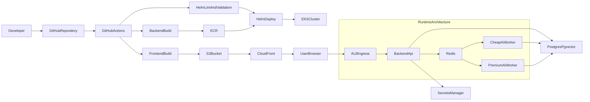
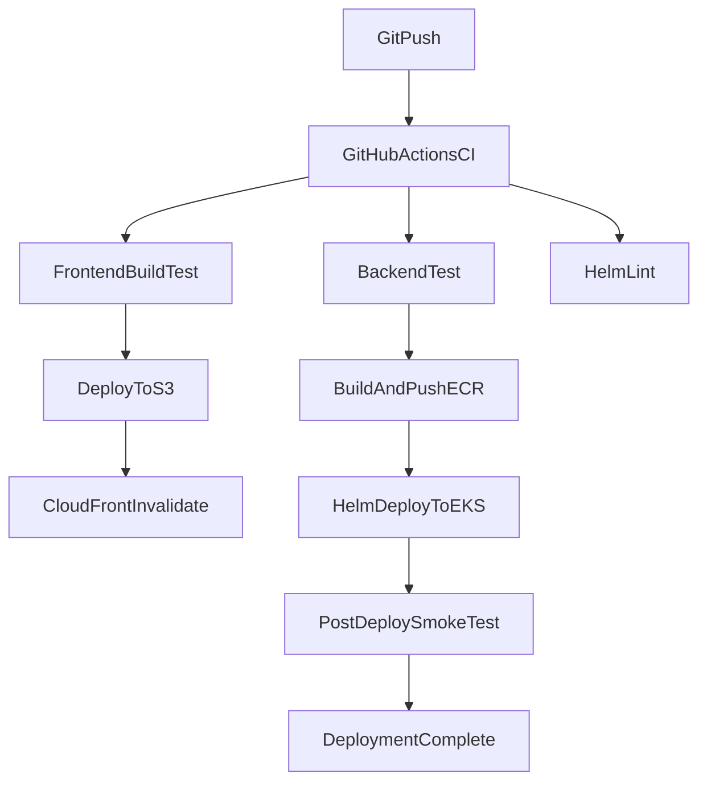

# 쿠버네티스 및 배포 상세 계획

## 목표

- 1차는 로컬과 저비용 AWS 자원만으로 전체 배포 구조를 검증한다.
- 2차는 `GitHub Actions + ECR + EKS + S3/CloudFront` 기준의 실제 운영 파이프라인까지 연결한다.
- 3차는 이 프로젝트의 핵심 차별점인 `cheap/premium AI 모델 분리`, `fallback`, `RAG`, `SSE`, `pgvector`를 운영 구조에 녹인다.
- 원칙은 `과한 마이크로서비스 분해를 피하고`, 현재 단일 백엔드를 유지하면서 배포 단위와 운영 단위만 점진적으로 분리하는 것이다.

## 현재 기준점

- 백엔드는 아직 컨테이너/배포 리소스가 없고, DB만 [docker-compose.yml](/Users/hyunchuljung/Desktop/sideProject(Gait)/GaitProject/docker-compose.yml) 에서 `pgvector/pgvector:pg16`로 실행 중이다.
- 백엔드는 [build.gradle.kts](/Users/hyunchuljung/Desktop/sideProject(Gait)/GaitProject/build.gradle.kts) 기준 `Spring Boot 3.2`, `Java 17`, `Web + JPA + Security + WebFlux + Spring AI` 조합의 단일 모듈이다.
- 운영 DB 설정은 [application-prod.yml](/Users/hyunchuljung/Desktop/sideProject(Gait)/GaitProject/src/main/resources/application-prod.yml) 기준으로 외부 PostgreSQL 접속을 전제로 한다.
- 로컬 설정은 [application-local.yml](/Users/hyunchuljung/Desktop/sideProject(Gait)/GaitProject/src/main/resources/application-local.yml), [config/.env.dev](/Users/hyunchuljung/Desktop/sideProject(Gait)/GaitProject/config/.env.dev) 처럼 환경변수 기반으로 분리되어 있다.
- 프론트는 [package.json](/Users/hyunchuljung/Desktop/sideProject(Gait)/GaitProject_frontend/package.json) 기준 Vite 빌드이며, [config.ts](/Users/hyunchuljung/Desktop/sideProject(Gait)/GaitProject_frontend/src/api/config.ts) 에서 `VITE_API_BASE_URL`을 빌드 타임에 주입받고, [index.ts](/Users/hyunchuljung/Desktop/sideProject(Gait)/GaitProject_frontend/src/router/index.ts) 에서 `createWebHistory()`를 사용한다.
- AI 임베딩은 [EmbeddingService.kt](/Users/hyunchuljung/Desktop/sideProject(Gait)/GaitProject/src/main/kotlin/com/gait/gaitproject/service/ai/EmbeddingService.kt), RAG 라우팅은 [RagRouter.kt](/Users/hyunchuljung/Desktop/sideProject(Gait)/GaitProject/src/main/kotlin/com/gait/gaitproject/service/rag/RagRouter.kt) 기반이라 외부 AI 장애와 모델 선택 정책이 운영 설계에 직접 연결된다.

## 최종 기술 선택

- CI/CD: `GitHub Actions`
- 컨테이너 레지스트리: `Amazon ECR`
- 쿠버네티스: `Amazon EKS`
- 프론트 배포: `S3 + CloudFront`
- 쿠버네티스 패키징: `Helm`
- 로컬 쿠버네티스: `k3d`
- Ingress:
  - 로컬 1차: `ingress-nginx`
  - AWS 운영: `AWS Load Balancer Controller + ALB Ingress`
- Secret 관리: `AWS Secrets Manager` 또는 `External Secrets Operator`
- DB:
  - 1차: 기존 `pgvector/pgvector:pg16`
  - 운영: pgvector 지원 PostgreSQL
- AI 비동기 처리: 2차에서 `Redis + KEDA`
- 관측성:
  - 1차: Spring Actuator + 로그
  - 2차: `Prometheus + Grafana + CloudWatch`

## 전체 구조도

## 핵심 설계 원칙

- 프론트는 정적 자원이므로 쿠버네티스에 올리지 않고 `S3 + CloudFront`로 분리한다.
- 백엔드는 처음에는 `backend-api` 단일 Deployment로 시작하고, 이후 `cheap-ai-worker`, `premium-ai-worker`를 분리한다.
- DB는 1차 검증 때는 로컬/간단 구성으로 유지하고, 운영에서는 클러스터 외부 관리형 PostgreSQL을 우선 고려한다.
- 배포 구조는 `작게 시작해서 운영 요소를 단계별로 추가`하는 방식으로 가져간다.

## 단계별 계획

### Phase 0. 준비 및 기준선 정리

목표:

- 배포 이전에 현재 앱이 어떤 제약을 갖는지 명확히 문서화한다.

작업:

- 백엔드 빌드/실행 기준 정리
  - Java 17
  - Spring profile
  - DB 연결 환경변수
  - AI API Key
- 프론트 빌드 기준 정리
  - `VITE_API_BASE_URL`
  - SPA fallback 필요
- SSE 요구사항 정리
  - 프록시 timeout
  - response buffering 비활성화
- DB 요구사항 정리
  - PostgreSQL
  - pgvector extension

산출물:

- 환경변수 목록
- 배포 시 필수 Secret 목록
- SSE/Ingress 요구사항 체크리스트

완료 기준:

- 컨테이너와 쿠버네티스 설계에 필요한 설정값이 빠짐없이 정리되어 있다.

### Phase 1. 컨테이너화

목표:

- 프론트와 백엔드가 CI와 쿠버네티스에서 동일한 방식으로 실행되도록 만든다.

작업:

- 백엔드 `Dockerfile`
  - multi-stage build
  - Gradle build 후 runtime image 분리
  - Java 17 slim 기반 사용
- 프론트 `Dockerfile`
  - Node build stage
  - 정적 서빙 stage 분리
- 이미지 태그 규칙 정의
  - `commit-sha`
  - `branch-name`
  - `latest`는 개발용에서만 제한 사용

산출물:

- backend image strategy
- frontend image strategy
- 이미지 버전 정책

완료 기준:

- 로컬 Docker build가 성공한다.
- 백엔드 컨테이너가 환경변수로 기동된다.
- 프론트 컨테이너가 정적 파일을 서빙한다.

### Phase 2. 로컬 쿠버네티스 구조 검증

목표:

- 비용 없이 쿠버네티스 구조 자체를 먼저 검증한다.

기술:

- `k3d`
- `Helm`
- `ingress-nginx`

작업:

- 로컬 클러스터 생성
- Helm chart 기본 구조 설계
  - `backend-api`
  - `frontend`
  - 선택적 `postgres`
- 로컬 Ingress 구성
  - `/` -> frontend
  - `/api` -> backend
- `ConfigMap`, `Secret` 분리
- readiness/liveness probe 기본 적용
- SSE 연결 테스트

DB 전략:

- 가장 현실적인 시작:
  - DB는 기존 compose 유지
  - k8s에는 앱만 올린다
- 구조 검증을 더 하고 싶으면:
  - `pgvector/pgvector:pg16` StatefulSet 추가

산출물:

- 로컬 Helm values
- k3d 구동 가이드
- 로컬 smoke test 체크리스트

완료 기준:

- 브라우저에서 앱 접속 가능
- 로그인/기본 API 가능
- SSE 채팅 가능
- RAG 검색이 기존과 동일하게 동작

### Phase 3. AWS 배포 최소 구조

목표:

- 실제 운영에 가까운 최소 AWS 배포 흐름을 만든다.

구성:

- 프론트: `S3 + CloudFront`
- 백엔드: `ECR + EKS`
- DB: 외부 PostgreSQL
- Secret: `Secrets Manager`

작업:

- AWS 리소스 정의
  - ECR repository
  - EKS cluster
  - IAM role
  - S3 bucket
  - CloudFront distribution
- 프론트 환경별 URL 전략 정의
  - dev
  - prod
- EKS namespace 전략 정의
  - `gait-dev`
  - `gait-prod`
- ALB Ingress 정책 정의
  - timeout
  - health check path
  - SSE 대응

완료 기준:

- 프론트는 CloudFront URL로 접속 가능
- 백엔드는 EKS ALB 뒤에서 응답 가능
- Secrets Manager를 통해 비밀값이 주입 가능

### Phase 4. CI/CD 파이프라인 설계

목표:

- Git push부터 실제 배포까지 자동화한다.

브랜치 정책:

- `feature/*`
  - 테스트와 빌드만 수행
- `main`
  - 프론트 배포
  - 백엔드 이미지 푸시
  - EKS 배포 수행

GitHub Actions 워크플로:

1. 프론트 CI

- `npm ci`
- `npm run build`

1. 백엔드 CI

- `./gradlew test`
- `./gradlew bootJar`

1. 인프라 검증

- `helm lint`
- values 검증

1. 이미지 빌드 및 푸시

- backend image build
- 필요 시 worker image build
- ECR push

1. 프론트 배포

- `dist` 업로드
- CloudFront invalidation

1. 백엔드 배포

- Helm upgrade
- rollout status 확인
- 실패 시 rollback 전략 정의

완료 기준:

- main push 시 수동 개입 없이 프론트/백엔드가 배포된다.
- 실패 시 어느 단계에서 실패했는지 로그로 추적 가능하다.

### Phase 5. 쿠버네티스 구조 고도화

목표:

- 이 프로젝트의 AI 특성을 운영 구조에 반영한다.

초기 구조:

- `backend-api`
  - 사용자 요청
  - 인증
  - SSE
  - AI Gateway 역할 일부 포함

확장 구조:

- `cheap-ai-worker`
  - 커밋 요약
  - 임베딩 생성
  - RAG query rewrite
- `premium-ai-worker`
  - deep merge
  - 고급 추론
  - 긴 문맥 처리

정책:

- `summary` -> cheap model 우선
- `embedding` -> cheap model 우선
- `chat` -> premium model 우선
- premium 모델 장애 시 cheap 모델로 fallback
- 임베딩 실패 시 즉시 사용자 실패보다 재시도 우선

완료 기준:

- 모델별 역할 분리가 문서와 구조로 설명 가능하다.
- 향후 worker 분리 구현이 가능한 수준으로 경계가 정의된다.

### Phase 6. Redis, 큐, 오토스케일

목표:

- 비동기 AI 작업을 분리하고, 쿠버네티스 오토스케일의 장점을 실제로 살린다.

도입:

- `Redis`
  - job queue
  - 캐시
  - rate limit
- `KEDA`
  - queue depth 기반 scale out

비동기 대상:

- Commit 요약
- Embedding 생성
- Merge 사전 분석
- 실패한 AI 작업 재시도

완료 기준:

- 채팅 API와 무거운 AI 작업이 분리된다.
- 큐 길이에 따라 worker 확장 정책을 설명할 수 있다.

### Phase 7. 테스트 전략

목표:

- 기능, 배포, 운영 관점 테스트를 계층적으로 구성한다.

테스트 계층:

1. 단위 테스트

- 서비스 로직
- RAG 라우팅
- AI fallback 정책

1. 통합 테스트

- Spring Boot + DB 연결
- pgvector 검색
- JWT 인증 흐름

1. 로컬 배포 테스트

- Docker build
- k3d smoke test
- Helm install/upgrade

1. 배포 후 smoke test

- health endpoint
- 로그인 API
- SSE 연결
- 대표 API 1~2개

1. 운영 검증

- pod readiness
- rollout status
- error rate
- fallback 발생률

추천 추가 도구:

- API smoke test: `Postman/Newman` 또는 간단한 curl script
- k8s manifest 검증: `helm lint`
- 추후 e2e: `Playwright`

완료 기준:

- 코드 테스트, 배포 테스트, 운영 smoke test가 구분되어 있다.
- main 배포 전에 어떤 검증이 필요한지 명확하다.

### Phase 8. 관측성과 비용 관리

목표:

- AI 프로젝트에 필요한 운영 가시성을 확보한다.

수집할 핵심 지표:

- 모델별 호출 수
- 요청 종류별 비용 추정
- fallback 횟수
- SSE 연결 수
- worker queue depth
- embedding 실패율
- RAG hit rate

도입 순서:

- 1차: actuator + 로그
- 2차: Prometheus + Grafana
- 3차: AI 비용 대시보드

완료 기준:

- 시스템이 죽었는지 뿐 아니라, AI 비용과 품질 저하 상황도 파악 가능하다.

## 환경별 구조

### 로컬/개발

- 프론트: 로컬 또는 로컬 컨테이너
- 백엔드: 로컬 또는 k3d
- DB: compose PostgreSQL
- 목적: 빠른 반복 개발

### 스테이징

- 프론트: S3/CloudFront
- 백엔드: EKS dev namespace
- DB: 운영과 유사한 외부 PostgreSQL
- 목적: 배포 검증

### 운영

- 프론트: S3/CloudFront
- 백엔드: EKS prod namespace
- worker: 필요 시 분리
- 목적: 안정적 서비스 운영

## 배포 흐름 요약

## 우선순위

- 우선순위 1: 컨테이너화
- 우선순위 2: 로컬 k3d + Helm 구조 검증
- 우선순위 3: GitHub Actions CI 구축
- 우선순위 4: AWS 최소 배포
- 우선순위 5: AI worker 분리와 fallback 정책
- 우선순위 6: Redis/KEDA
- 우선순위 7: 관측성과 비용 대시보드

## 시작 전략

가장 추천하는 시작 방식은 아래다.

- 설계는 `최종 운영 구조`까지 한 번에 해둔다.
- 구현은 `로컬 검증 -> AWS 최소 배포 -> AI 분리` 순서로 간다.
- 즉, `B안 설계 + A안 구현 시작` 전략을 유지하되, 이번 버전에서는 AWS 파이프라인까지 함께 포함한다.

## 핵심 메시지

이 계획의 핵심은 다음 한 줄로 정리된다.

- 프론트는 `S3 + CloudFront`로 저비용 정적 배포하고, 백엔드와 AI worker는 `EKS`에 배포하며, `GitHub Actions + ECR + Helm`으로 자동 배포하고, AI 모델은 `cheap/premium` 역할 분리와 `fallback` 정책을 통해 비용과 가용성을 함께 관리한다.

