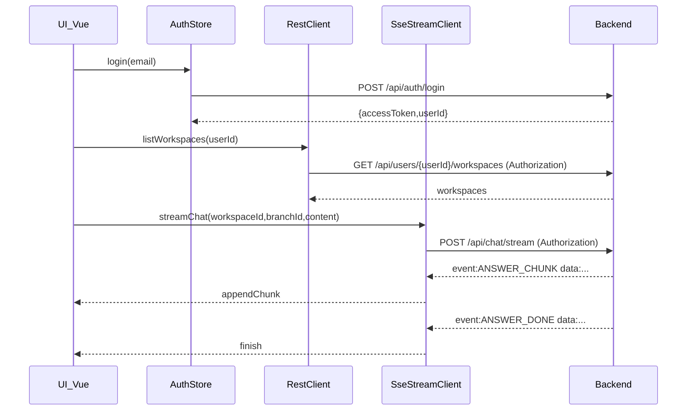

# GaitProject_frontend 프론트 틀 구축 계획

## 목표

- `GaitProject_frontend/docs/GaitChatDesign.html` 디자인을 기준으로 **Vue 3 컴포넌트 구조**를 만들고
- 백엔드(`GaitProject`)의 **Swagger/OpenAPI**를 기준으로 **타입/클라이언트 자동생성**을 붙인 뒤
- **JWT(Bearer) 인증 + POST SSE 스트리밍 채팅**까지 동작하는 MVP 골격을 단계적으로 완성합니다.

## 현재 확인된 백엔드 계약(프론트 설계에 영향 큰 것만)

- **Swagger/OpenAPI**: `springdoc-openapi` 사용, 문서 엔드포인트는 `/v3/api-docs/**`, UI는 `/swagger-ui/**` (permitAll)
- **인증**: `Authorization: Bearer <JWT>` 헤더 기반
  - 발급: `POST /api/auth/signup`, `POST /api/auth/login` (MVP: email 기반)
- **SSE 스트리밍**: `POST /api/chat/stream` + `text/event-stream`
  - 이벤트 name: `ANSWER_CHUNK` 여러 번 → `ANSWER_DONE` 1번
  - data: `ApiResponse.ok(SseEvent(...))` JSON
- **핵심 리소스**:
  - Workspace: `POST /api/workspaces`, `GET /api/workspaces/{workspaceId}`, `GET /api/users/{userId}/workspaces`
  - Branch: `GET/POST /api/workspaces/{workspaceId}/branches`
  - Message: `POST /api/workspaces/{workspaceId}/branches/{branchId}/messages`, `GET .../messages/timeline?after&limit`
  - Commit: `POST /api/workspaces/{workspaceId}/branches/{branchId}/commits`
  - Merge: `POST /api/workspaces/{workspaceId}/merges`
- **CORS(local)**: `http://localhost:5173` 허용

## 아키텍처 결정(권장안)

- **프로젝트 생성**: Vite + Vue 3 + TypeScript
- **상태관리**: Pinia
- **라우팅**: Vue Router (최소 2~3개 화면)
- **스타일**: TailwindCSS (디자인 파일이 Tailwind 기반이라 그대로 이식)
- **API 클라이언트**:
  - REST: OpenAPI 기반 타입/클라이언트 자동생성 결과를 사용
  - SSE: OpenAPI 생성물과 별도로 `fetch()` 스트리밍 파서(POST + Authorization 헤더 필요)로 구현

## 화면/컴포넌트 분해(디자인 파일 기준)

- **레이아웃**
  - `AppShell`: 좌측 사이드바 + 우측 채팅 영역
- **좌측(사이드바)**
  - `RepoHeader` (repo 이름, commits count)
  - `GitGraph` (SVG paths/nodes)
  - `CommitList` / `CommitListItem`
  - `SidebarFooter` (플랜/토큰 표시 + 테마 토글)
- **우측(채팅)**
  - `ChatHud` (HEAD/branch/Detached 표시 + NewBranch/Commit 버튼)
  - `ChatMessages` (메시지/커밋 마커 렌더)
  - `ChatComposer` (textarea + send)
  - `Toast`
  - `CommitModal`, `BranchModal`

## 개발 순서(“틀을 빠르게 세우고 점진적으로 실제 API 연결”)

1. **Vite 프로젝트 스캐폴딩**

   - `GaitProject_frontend/`에 Vue3+TS 프로젝트 생성
   - TailwindCSS/FontAwesome/폰트 설정을 Vite 방식으로 이식
   - `.env`에 `VITE_API_BASE_URL` (예: `http://localhost:8080`) 추가

2. **라우팅/스토어 골격**

   - Routes 예시
     - `/login` (email 입력 → 토큰 발급)
     - `/` (워크스페이스 선택/생성)
     - `/w/:workspaceId/b/:branchId` (메인 채팅 화면)
   - Pinia Stores
     - `authStore`: `accessToken`, `userId`, 로그인/로그아웃
     - `workspaceStore`: workspace 목록/선택
     - `chatStore`: 현재 workspace/branch, messages, commit graph 상태

3. **OpenAPI 기반 타입/클라이언트 자동생성 파이프라인**

   - 백엔드가 켜진 상태에서 `/v3/api-docs`를 받아
   - 프론트에 `src/api/generated/`로 생성(REST용)
   - `npm scripts`로 `generate:api` 제공(재생성 원클릭)

4. **REST MVP 연결**

   - 로그인: `/api/auth/login` → 토큰 저장(우선 localStorage)
   - 워크스페이스 목록: `/api/users/{userId}/workspaces`
   - 브랜치 목록/생성: `/api/workspaces/{workspaceId}/branches`
   - 타임라인 로딩: `GET .../messages/timeline`

5. **SSE(POST 스트리밍) 연결**

   - `POST /api/chat/stream` 호출 시 Authorization 헤더 포함
   - SSE 파서로 `ANSWER_CHUNK`를 메시지에 누적 렌더, `ANSWER_DONE`에서 종료 처리

6. **GaitChatDesign.html UI를 실제 데이터로 치환**

   - 디자인의 demo state(`commits`, `snapshots`, `messages`)를 Pinia + API 결과로 교체
   - Detached HEAD/graph 계산 로직은 컴포넌트/컴포저블로 분리

7. **마무리(개발 편의/품질)**

   - 공통 API 에러 처리(401 → 로그인 이동)
   - 토큰 만료/재로그인 UX
   - 로컬 개발 가이드(백엔드/프론트 동시 실행)

## 핵심 파일(예상 생성/변경 위치)

- 프론트(신규)
  - `GaitProject_frontend/src/main.ts`, `src/App.vue`
  - `src/router/index.ts`
  - `src/stores/auth.ts`, `src/stores/workspace.ts`, `src/stores/chat.ts`
  - `src/api/http.ts` (Bearer 자동 주입)
  - `src/api/sseChatStream.ts` (POST SSE 파서)
  - `src/api/generated/**` (OpenAPI 생성물)
  - `src/components/**` (디자인 컴포넌트 분해)
  - `src/pages/LoginPage.vue`, `WorkspacePage.vue`, `ChatPage.vue`

## 데이터 흐름(요약)

---

## 체크(당장 막힐 수 있는 포인트)

- **SSE는 POST**라서 EventSource 대신 `fetch` 스트리밍 파서가 필요합니다.
- MVP 인증이 email 기반이라 로그인 UX는 가볍게 시작 가능합니다(추후 password/refresh 확장 가능).