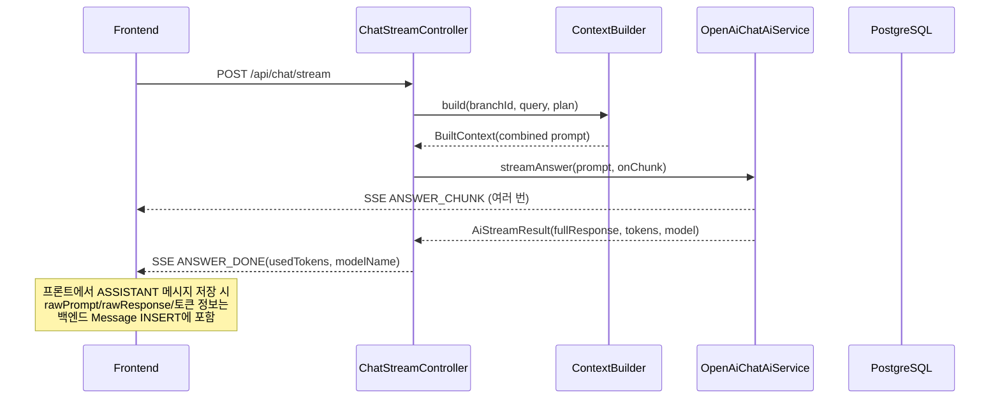

# Raw Payload 추적 및 토큰 사용량 기록 구현

## 범위

- rawPrompt/rawResponse/토큰 사용량을 DB에 **기록**하는 것까지만 구현
- 과금(잔여 토큰 차감, 한도 체크, CreditLog, TokenBillingService 등)은 **이번 범위에서 제외** (구독/충전 시스템 완성 후 별도 진행)

## 현재 구조 분석

- `Message` 엔티티: `inputTokens`, `outputTokens`, `modelName` 필드가 이미 있지만 **값이 채워지지 않음**
- `AiService` 인터페이스: `streamAnswer(prompt, onChunk)` → `Unit` 반환이라 **토큰 사용량을 받을 수 없음**
- `ChatStreamController`: 컨텍스트 조립 -> AI 호출 -> SSE 전송만 하고 **토큰 기록은 안 함**

## 변경 파일 목록

### 1) Entity 수정

[domain/chat/entity/Message.kt](src/main/kotlin/com/gait/gaitproject/domain/chat/entity/Message.kt)

- `rawPrompt: String?` (columnDefinition = "text") 추가 - LLM으로 보낸 최종 프롬프트
- `rawResponse: String?` (columnDefinition = "text") 추가 - LLM 순수 응답 전문
- `totalTokens: Int?` 추가 - inputTokens + outputTokens 합계 편의 필드
- 기존 `inputTokens`, `outputTokens`, `modelName` 필드는 그대로 활용

### 2) AiService 인터페이스 확장

[service/ai/AiService.kt](src/main/kotlin/com/gait/gaitproject/service/ai/AiService.kt)

```kotlin
data class AiStreamResult(
    val fullResponse: String,
    val promptTokens: Int?,
    val completionTokens: Int?,
    val totalTokens: Int?,
    val modelName: String?
)

interface AiService {
    fun streamAnswer(prompt: String, onChunk: (String) -> Unit): AiStreamResult
}
```

- `Unit` 반환을 `AiStreamResult`로 변경
- 모든 구현체(OpenAiChatAiService, StubAiService, GeminiFlashService, GeminiProService) 시그니처 맞춤

### 3) OpenAiChatAiService 수정

[service/ai/OpenAiChatAiService.kt](src/main/kotlin/com/gait/gaitproject/service/ai/OpenAiChatAiService.kt)

- Spring AI의 `StreamingChatModel.stream()` 결과에서 토큰 사용량 파싱
- 전체 응답 텍스트를 축적하여 `AiStreamResult.fullResponse`에 담아 반환
- `@Value`로 `OPENAI_MODEL` 주입하여 `modelName`에 설정

### 4) StubAiService 수정

[service/ai/StubAiService.kt](src/main/kotlin/com/gait/gaitproject/service/ai/StubAiService.kt)

- `AiStreamResult` 반환 (토큰=0, 모델="stub")

### 5) ChatStreamController 수정

[controller/chat/ChatStreamController.kt](src/main/kotlin/com/gait/gaitproject/controller/chat/ChatStreamController.kt)

- AI 스트리밍 완료 후 `AiStreamResult`에서 토큰 사용량 추출
- `ANSWER_DONE` SSE 이벤트 payload에 `usedTokens` 포함
- (향후 과금 시스템 연결 시 이 지점에서 `TokenBillingService` 호출 예정)

### 6) 프론트엔드 토큰 표시

[ChatPage.vue](../../GaitProject_frontend/src/pages/ChatPage.vue)

- `onDone` SSE 핸들러에서 `usedTokens`를 파싱해 토스트로 표시 (예: "이번 대화: 230 tokens 사용")

## 데이터 흐름



## DB 스키마 변경

`messages` 테이블에 컬럼 추가 (Hibernate ddl-auto=update 자동 반영):

- `raw_prompt TEXT`
- `raw_response TEXT`
- `total_tokens INTEGER`

## 향후 연결 포인트 (이번 범위 밖)

- `TokenBillingService`: 과금/차감/한도 체크 → 구독/충전 시스템 완성 후
- `CreditLog` 기록: 위 서비스에서 처리
- `remainingTokens` 반환: 위 서비스 완성 후 ANSWER_DONE에 추가
- 프론트 "1.2M Tokens left" UI: 실제 잔여 토큰 API 연동 후

